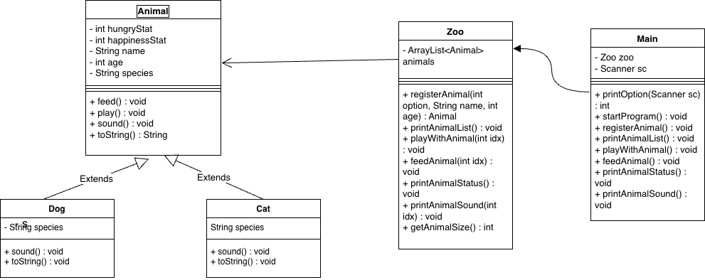

# animal-management-system
기본 반려동물 관리 시스템입니다.
1. 기본기능
- 반려동물 등록 및 관리
- 동물과의 상호작용 (먹이주기, 놀아주기)
- 동물 상태 조회 및 관리
- 콘솔 기반 사용자 인터페이스

2. 클래스 다이어그램 (level-1)
   

3. 실행방법
- Main 클래스의 startProgram() 함수를 실행하면 된다.